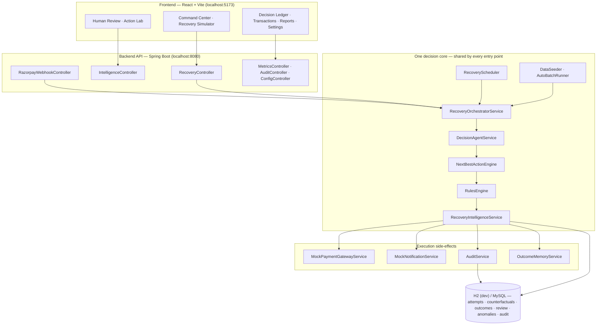

# RecoveryOS — Autonomous Revenue Recovery Intelligence

**RecoveryOS** (previously *Revenue Recovery Agent*) is an autonomous revenue-recovery intelligence system. It does not ask *"which failed payment should I retry?"* — it answers *"for this customer, at this moment, what is the NEXT BEST RECOVERY ACTION that creates the highest **incremental** net revenue?"* and proves the answer with counterfactual simulation.

Built for the Razorpay AI Buildathon (Track 03).

<!-- TODO: Record a 90-second screen capture, save as docs/demo.gif + docs/demo-thumbnail.png,
     then uncomment the line below. See docs/DEMO_SCRIPT.md for the walkthrough outline. -->
<!-- [](docs/demo.gif) -->

## What this does

The system runs a **detect → diagnose → simulate → select → execute → learn** loop across three revenue sources: **payment failures** (subscription dunning), **checkout abandonment** (cart recovery), and **B2B overdue receivables** (invoice recovery). For every eligible item the **Recovery Intelligence Engine** (package `com.razorpay.recovery.intelligence`) counterfactually simulates *every* bounded action — retry now / retry later / silent retry / payment link / 5–25% discount tiers / reminder / payment plan / escalation — scores each by expected **net** value (recovered − discount cost − intervention cost − risk penalty) over a natural-recovery baseline, and executes the winner. `RulesEngine` hard bounds and uplift/fatigue policies are enforced *before* anything runs; a live LLM (optional) only ever explains a structured decision, never chooses one. Every decision, outcome and review action is persisted for the Action Performance Lab and outcome learning.

## Architecture

### Whole-system view



Four layers, one decision core:

1. **Frontend** — a React single-page app. All screens read the same persisted state, so the dashboard, the Decision Ledger and the Simulator can never disagree.
2. **Backend API** — thin Spring controllers over the domain; responses are DTOs (OSIV is off), and the SSE endpoint streams batch progress live.
3. **One decision core** — every entry point (manual batch, SSE batch, scheduler, startup auto-run, webhook) funnels into `RecoveryOrchestratorService.runBatchWithCallback`, so no code path can produce a different decision for the same entity.
4. **Side-effects & storage** — a decision executes against pluggable payment/notification adapters (mocks by default), is audited, recorded as an outcome, and remembered by the Outcome Memory.

### Module map (backend `com.razorpay.recovery`)

| Package | Responsibility | Key classes |
|---|---|---|
| `api` | DTO layer — OSIV-off JSON mapping, query assembly | `TransactionDto` · `AttemptDto` · `ReceivableDto` · `RecoveryApiService` |
| `recovery` | the bounded core: batch orchestration, decision seam, rules, attempt ledger | `RecoveryOrchestratorService` · `DecisionAgentService` · `RulesEngine` · `RecoveryController` · `RecoveryAttempt` · `UpliftSegmentationService` |
| `recovery/mocks` | pluggable gateway/notification adapters (deterministic in demo) | `MockPaymentGatewayService` · `MockNotificationService` |
| `intelligence` | the decision intelligence: engine, uplift model, fatigue, state, confidence, value optimizer, anomalies, experiments; persisted decision artefacts | `NextBestActionEngine` · `UpliftScoringService` · `RecoveryFatigueService` · `CustomerStateService` · `DecisionConfidenceService` · `RecoveryValueOptimizer` · `AnomalyDetectionService` · `RecoveryIntelligenceService` · `OutcomeMemoryService` · `CounterfactualDecision` · `HumanReviewCase` |
| `customer` · `subscription` · `transaction` · `checkout` · `receivable` | domain entities for the three revenue sources + customer profile | `Customer` · `Subscription` · `Transaction` · `CheckoutSession` · `Receivable` |
| `scheduler` | scheduled batch with an in-flight collision guard | `RecoveryScheduler` |
| `config` | runtime bounds + editor, deterministic seeding, startup auto-batch, CORS | `BoundsConfig` · `ConfigController` · `DataSeeder` · `AutoBatchRunner` · `WebConfig` |
| `metrics` | live / held-out / control-group metrics, funnel, action ROI, uplift | `MetricsService` · `MetricsController` |
| `audit` | append-only pipeline trail (ingest, evaluate, decide, execute, skip, batch) | `AuditService` · `AuditEvent` · `AuditController` |

### Frontend layout

- **Entry** — `frontend/src/main.jsx` → `App.jsx` (left-rail navigation across the 11 screens, top header with Run Batch ▶ / pending-review badge / live “last updated”, main content area).
- **Data layer** — `frontend/src/api.js` maps every REST endpoint and provides the SSE reader (`runBatchStream`) that streams each attempt and the final `{processed, skipped, failed}` counts.
- **Views** — stat grids and charts (`StatCard`, `RecoveryChart`, `FunnelChart`, `ActionBreakdownChart`), tables + row drill-down (`AttemptTable`, `TransactionModal`), and the decision-specific screens (`RecoverySimulator`, `HumanReview`, `ActionLab`, `LedgerTape`, `PendingReview`, `BoundsRegister`).
- **State** — held in `App.jsx` (metrics, command-center aggregates, attempts, review queue, batch progress). Attempts and transactions are re-pulled on every load, so the ledger survives a page refresh.

### One pipeline, every entry point

The manual batch (`POST /api/recovery/run-batch`), the SSE streaming batch, the scheduler, the startup auto-run and webhook-ingested items all funnel into the **same processing core** — `RecoveryOrchestratorService.runBatchWithCallback` — so no code path can ever produce a different decision for the same entity. The intelligence engine is a single Spring-injected singleton shared by every caller (no manual `new` anywhere in production code).

```
        ALL ENTRY POINTS (REST · SSE · scheduler · startup · webhook)
                                │
              RecoveryOrchestratorService (one batch core)
                                │
   DecisionAgentService ──▶ NextBestActionEngine (single bean)
                                │
     RulesEngine hard bounds (retries · cooldown · discount ceilings · uplift segment)
                                │
    execution (mock gateway / notifications) ──▶ audit ──▶ outcome ──▶ Outcome Memory
```

### The decision pipeline

```
PAYMENT / CHECKOUT / RECEIVABLE
  ↓ eligibility (RulesEngine: allowed actions, segment bounds, cooldown, idempotency)
  ↓ customer recovery state + fatigue score
  ↓ ACTION FRONTIER — counterfactual simulation of every eligible action
  ↓ DecisionScore = expectedIncrementalRecovery − interventionCost − discountCost − fatiguePenalty − riskPenalty
  ↓ best valid action (RecoveryValueOptimizer) + confidence + automation policy
  ↓ AUTO_EXECUTE · SAFE_ACTION_ONLY · HUMAN_REVIEW
  ↓ bounded execution → audit event → RecoveryOutcome → Outcome Memory / Action Lab
```

**The engine is deterministic and pure** — identical input always yields the identical decision, which is what makes REST vs SSE vs scheduler runs agree and the demo reproducible. A live LLM (optional) only explains a decision afterwards; it never chooses one (`llmDriven=true` strictly requires a real API response — nothing is faked).

### Core data model

| Entity | Role |
|---|---|
| `Transaction` · `CheckoutSession` · `Receivable` | the three revenue sources; each carries a unique `eventId` (webhook idempotency) |
| `RecoveryAttempt` | the decision ledger: action, confidence, outcome, provenance (`decisionSource` + `engineVersion`), fatigue/state, decision trace |
| `CounterfactualDecision` | every simulated action for a case, with the selected one flagged |
| `RecoveryOutcome` | the training record (action, success, net value, failure context, segment) |
| `HumanReviewCase` | approve / override / reject with reason + audit trail |
| `RecoveryAnomaly` · `RecoveryExperiment` | risk findings and declared experimentation policies |
| `AuditEvent` | append-only pipeline trail (ingest, evaluate, decide, execute, skip, batch) |

### The Recovery Intelligence layer (new)

| Concept | Where | What it proves |
|---|---|---|
| Next-Best-Action engine | `intelligence/NextBestActionEngine.java` | simulates every eligible action and picks the highest **incremental net value** |
| Multi-action uplift scoring | `intelligence/UpliftScoringService.java` | per-action success vs. natural baseline; discounts are not wasted on sure-things or transient failures |
| Value optimizer | `intelligence/RecoveryValueOptimizer.java` | cost/discount/risk-aware selection, never success-rate-only |
| Customer recovery state | `intelligence/CustomerStateService.java`, `RecoveryState.java` | NEW_FAILURE → REPEATED_FAILURE → RECOVERY_FATIGUE → STOP_INTERVENTION |
| Recovery fatigue engine | `intelligence/RecoveryFatigueService.java` | suppresses contact as fatigue rises; severe fatigue stops automation |
| Decision confidence | `intelligence/DecisionConfidenceService.java` | <60% → HUMAN_REVIEW, ≥85% → AUTO_EXECUTE |
| Counterfactual decisions (persisted) | `intelligence/CounterfactualDecision.java` | every simulation row is stored; the selected row is flagged |
| Outcome learning | `intelligence/RecoveryOutcome.java`, `OutcomeLearningService.java` | per-action success/net-value stats feed the Action Lab |
| Outcome Memory | `intelligence/OutcomeMemoryService.java`, `GET /api/intelligence/outcome-memory` | history remembered as (source × failure context × segment × action) priors — what has actually worked for THIS situation, best net value first |
| Human review queue | `intelligence/HumanReviewCase.java` | approve / override / reject with audit trail |
| Anomaly detection | `intelligence/AnomalyDetectionService.java` | large failures, repeat failures, fatigue risk → HIGH/CRITICAL route to review |
| Experimentation policy | `intelligence/RecoveryExperiment.java` | declared control/treatment policies, kept out of per-item decisions |
| Recovery Timeline | `GET /api/intelligence/timeline` | every attempt on one entity, oldest → newest |


### The bounded recovery core

| Layer | File |
|---|---|
| Hard policy bounds (retries · cooldown · discount ceilings · sign-off triggers) | `recovery/RulesEngine.java` |
| Decision seam: engine decides, optional LLM explains | `recovery/DecisionAgentService.java` |
| Single batch core (REST · SSE · scheduler · startup · webhook) | `recovery/RecoveryOrchestratorService.java` |
| Engine wiring — one injected singleton, no manual `new` anywhere | `intelligence/*` (all Spring beans) |
| Decision provenance | `RecoveryAttempt.decisionSource` / `.engineVersion` — `RECOVERY_INTELLIGENCE_ENGINE` + `RECOVERY_INTELLIGENCE_V1` (or `MANUAL_HUMAN_OVERRIDE` after a human review override) |
| Honest metrics (recovered − intervention cost, held-out scope) | `metrics/MetricsService.java` |
| Deterministic synthetic dataset (320 items, fixed seed) | `config/DataSeeder.java` |
| Human sign-off queue | `RecoveryController` (`GET /api/recovery/pending-review`) |
| Live bounds editor (runtime, no restart) | `config/ConfigController.java` (`PUT /api/config/bounds`) · `config/BoundsConfig.java` |
| Silent-first recovery (`RETRY_SILENT` on first retryable failure) | `RulesEngine.eligibleActions()` |
| Segment-aware bounds (HIGH_VALUE: 5 retries · 25% ceiling) | `BoundsConfig.boundsFor(segment)` |
| B2B KPIs — DSO and promise-to-pay tracking | `metrics/MetricsService` · `Receivable.promiseStatus` |

## Key design principles (what makes it different)

1. **Incremental value, not success probability.** The engine prices the *lift* over the natural-recovery baseline and subtracts the true cost of margin, fatigue and risk. A 90%-success discount that gives away more than it creates loses to a cheaper action with lower headline success (see `rank_prefersHighestNetValue_overHighestSuccessRate` and the counterfactual view in the Decision Ledger).
2. **Counterfactuals, not retry chains.** Every decision stores the full set of actions it *didn't* take and why — explainable by construction.
3. **Fatigue-aware, not spam.** Repeated touchpoints raise a fatigue score (0→1) that de-escalates contact and finally stops automation or routes to a human.
4. **Human-in-the-loop.** Confidence < 60%, the last retry before a segment limit, oversize discounts, and HIGH/CRITICAL anomalies route to the review queue with approve/override/reject — all audited.
5. **Honest AI.** The engine decides; the LLM (optional) only explains. Every attempt is stamped with `RECOVERY_INTELLIGENCE_V1` / `decisionSource`; fallbacks and human overrides are recorded, never disguised as AI.
6. **Exactly-once execution.** Webhook duplicates are impossible: DB unique constraint on `eventId` + indexed `existsByEventId` pre-check + SUCCESS-attempt skip in the batch.
7. **Learning-ready.** Every outcome is persisted (context × segment × action) and aggregated into the Outcome Memory — a clean training signal for future ML, already powering the Action Performance Lab.
8. **Measured, not claimed.** ~20% of entities are held out for evaluation; ~15% form a no-intervention control group; metrics are computed live from the actual ledger.

## Non-negotiable constraints

Pulled from `application.properties` → `BoundsConfig.java` → `RulesEngine.java`:

| Rule | Default limit |
|---|---|
| Max retry attempts per item | 3 (STANDARD) · 5 (HIGH_VALUE) |
| Cooldown between retries | 60 minutes |
| Max discount the agent can offer | 15% (STANDARD) · 25% (HIGH_VALUE) |
| Minimum amount eligible for a discount | ₹500 |
| Actions requiring human sign-off | Discount above the segment's ceiling, or the last retry before the segment's limit |
| **Idempotency guarantee** | **DB unique constraint on `eventId` + application-level pre-check; second batch run skips already-recovered items** |
| **Held-out evaluation split** | **20% of each entity type is held out (random, fixed seed); agent never sees these items; held-out metrics reported separately** |

These are enforced in plain Java (`RulesEngine`), evaluated **before** any LLM output is allowed to execute. The bounds are changeable at runtime via `PUT /api/config/bounds` — no server restart needed.

**Idempotency** is enforced at two layers: (1) a `UNIQUE` database constraint on each entity's `eventId` field, which physically rejects duplicates at the storage level, and (2) an application-level pre-check in `RecoveryOrchestratorService` that skips any entity with an existing `SUCCESS` recovery attempt, preventing double-charges and double-counted metrics.

**Held-out split** uses a `boolean isHeldOut` field on every entity, populated by `DataSeeder` with a fixed random seed (~20% per source type, reproducible across runs). This field is never read by `DecisionAgentService` or `RulesEngine` — it is purely a post-hoc label used only by `MetricsService` when computing `?scope=held-out` metrics, making recovery-rate claims credible on unseen data.

## Predictable demo scenarios

`DataSeeder` additionally seeds ten **named** cases so a demo is predictable. Open the Decision Ledger and search by customer name:

| Case | Seed | Expected next-best action |
|---|---|---|
| Riya Sharma (self-heal) | ₹9,999 · NETWORK_ERROR · reliability 0.88 | RETRY_SILENT — state LIKELY_TO_SELF_RECOVER, no customer contact |
| Aarav Mehta (dead card) | ₹4,999 · CARD_EXPIRED · 1 retry | SEND_PAYMENT_LINK (discount simulated but rejected) |
| Kabir Nair (retry window) | ₹2,000 · UPI_TIMEOUT · 1 retry | RETRY_NOW |
| Meera Iyer (high value) | ₹15,999 · INSUFFICIENT_FUNDS · 2 retries · HIGH_VALUE | OFFER_DISCOUNT up to 20% (25% ceiling, > the 15% STANDARD cap) |
| Dev Rao (final attempt) | ₹899 · UPI_PIN_MISMATCH · 2 retries | RETRY_SCHEDULED flagged for human sign-off |
| Zoya Khan (big ticket) | ₹1,50,000 · CARD_STOLEN_FLAG | anomaly HIGH → review case |
| Kavya Singh (price-hesitant cart) | ₹24,999 checkout · PRICE_HESITATION | OFFER_DISCOUNT (15%) |
| Nikhil Verma (distracted cart) | ₹9,999 checkout · DISTRACTED | SEND_PAYMENT_LINK |
| Metro Logistics | ₹2,50,000 invoice · 60 days overdue | OFFER_PAYMENT_PLAN |
| GreenLeaf Foods | ₹85,000 invoice · broken promise, 10 days | PROMISE_FOLLOWUP |

Expected *decisions* are deterministic (the engine uses no randomness); *outcomes* follow the mocked conversion model, so recovered totals vary per run while decisions do not.

## New API surface

| Endpoint | Purpose |
|---|---|
| `POST /api/intelligence/simulate` | Recovery Simulator — returns state, fatigue, counterfactual ranking, chosen action |
| `GET /api/intelligence/command-center` | Command Center aggregates |
| `GET /api/intelligence/counterfactuals?sourceType=&id=` | persisted simulation rows for a case |
| `GET /api/intelligence/timeline?sourceType=&id=` | recovery timeline of a case |
| `GET /api/intelligence/review` · `POST /api/intelligence/review/{id}/resolve` | human review queue + approve/override/reject |
| `GET /api/intelligence/anomalies` | anomaly feed |
| `GET /api/intelligence/experiments` · `POST /api/intelligence/experiments` | experimentation policies |
| `GET /api/intelligence/action-performance` | Action Performance Lab (ranked by net value) |
| `GET /api/intelligence/outcome-memory` | context × segment × action priors from outcome history |

## Running it locally

### Backend

```bash
cd backend
mvn spring-boot:run
```

Runs on `http://localhost:8080` with an in-memory H2 database — **no setup required**. `DataSeeder` seeds 200 payment failures + 80 checkout abandonments + 40 overdue receivables (320 items total) and auto-runs a recovery batch on startup, so the dashboard shows real data immediately.

### Frontend

```bash
cd frontend
npm install
npm run dev
```

Runs on `http://localhost:5173`. Automatically connects to the backend at `localhost:8080` — no `.env` file needed for local dev.

### Optional: LLM explanation layer (Claude)

```bash
export ANTHROPIC_API_KEY=sk-ant-...
export LLM_ENABLED=true
cd backend && mvn spring-boot:run
```

Without these the deterministic engine is still the decision-maker; the LLM explanation layer is simply skipped (`llmDriven=false`) — the demo never breaks and nothing is ever faked.

## Tests

All backend tests pass — **104 tests, 0 failures** via `mvn -f backend/pom.xml clean test` — and GitHub Actions runs that plus the frontend build on every push to `main`.

- **Unit** — `NextBestActionEngineTest` (net-value ranking beats headline success rate, discount-tier ceilings per segment, fatigue suppression, confidence policy, determinism), `RulesEngineTest`, `DecisionAgentServiceTest`, `UpliftSegmentationServiceTest`, `RecoveryIntelligenceServiceTest`, `OutcomeMemoryServiceTest`, `MetricsServiceTest`, `IdempotencyTest`, `LiveBoundsEditorTest`.
- **Integration** (`@SpringBootTest` — `RecoveryPipelineIntegrationTest`) — transactions serialise with OSIV disabled (DTO mapping, no lazy-loading exceptions), HIGH_VALUE vs STANDARD retry limits enforced by the real batch, duplicate webhooks rejected by both the API and the DB `eventId` unique constraint, persisted attempts survive a fresh request newest-first, audit lifecycle events fire, the scheduler skips gracefully when a batch is already running, SSE `total` equals the real worklist size, and a real batch run stamps engine provenance and persists counterfactual rows.
- **Frontend** — `npm run build` (Vite) stays clean; the dev server at `localhost:5173` talks to the backend at `localhost:8080`.

## Results — how to read the demo numbers

The seeded dataset and every mock outcome are **deterministic** (all `Random` instances are fixed-seed `42`), so a fresh run of the same code on the same database state reproduces the same decisions and the same metrics. The exact headline figures (recovery rate, net revenue recovered, uplift deltas) are **computed live by the backend** from the actual batch, so the numbers on the dashboard are always internally consistent — do not hardcode them into a script.

What the seeded run guarantees (structural, not random):

- **320 items auto-seeded** on startup: 200 payment failures + 80 abandoned checkouts + 40 overdue receivables. A recovery batch auto-runs so the dashboard is populated on first load.
- **~20% of each source is held out** (evaluation-only, never touched by the agent's tuning) and **~15% is a control group** that receives no agent intervention — both reproducible from the fixed seed.
- **~Top 20% by transaction value are HIGH_VALUE customers** with wider bounds: 5 retries / 25% discount ceiling vs 3 retries / 15% for STANDARD.
- **Silent-first recovery:** first-attempt retryable payment failures get `RETRY_SILENT` (zero customer contact); customer-facing actions only open up after the silent path is exhausted.
- **B2B receivables KPIs** (DSO, average days overdue, promise-keep rate) and the **held-out subset metrics** are shown live in the Reports page.
- **Agent vs baseline** and **uplift analysis (control vs treatment by segment)** are computed from the actual attempt ledger at runtime.

Run the app, click **Run Batch**, and read the cards/charts for the current figures — the **Net recovered vs baseline** chart is the headline number, and the **Reports → Uplift Analysis** table shows which segment actually benefits from intervention.

## Uplift-aware targeting

Not every recovered rupee required the agent's help — some customers would have paid anyway, and overspending discounts on them is wasted margin. This project implements a lightweight uplift-aware targeting layer on top of the bounded-action pipeline.

**How it works:** A held-out control group (~15% of all entities) receives zero agent intervention. Their recovery rate establishes the natural-recovery baseline — what would have happened without the agent. Every remaining entity is classified into one of four causal-response segments using a heuristic model built from features already available on the entity (reliability score, failure reason, retry history, amount):

| Segment | Rule | What it means |
|---|---|---|
| **SURE_THING** | High reliability + soft failure (network error, bank timeout) | Would recover anyway — discounts are wasted margin |
| **PERSUADABLE** | Default — the majority case | Intervention genuinely changes the outcome |
| **DO_NOT_DISTURB** | Failed-once + small amount | A message/discount on a low-value, already-failed case risks annoyance for little upside |
| **LOST_CAUSE** | Low reliability + hard decline (card stolen, invalid CVV) | No intervention meaningfully changes a hard, non-retryable decline |

The `RulesEngine` enforces this in code: SURE_THING and LOST_CAUSE entities have `OFFER_DISCOUNT` removed from their eligible action set; DO_NOT_DISTURB entities have both `SEND_PAYMENT_LINK` and `OFFER_DISCOUNT` removed. This is a real tightening of the bounded-action set, not just a label.

**Where to see it live:** Reports → **Uplift Analysis** shows the control-vs-treatment recovery rates and the per-segment delta (Δ) computed from the actual attempt ledger after each batch. The expected shape, from the probability models above: PERSUADABLE shows the largest positive delta (intervention clearly helps), SURE_THING and LOST_CAUSE deltas are near zero (intervention adds little), and DO_NOT_DISTURB can be slightly negative — evidence that the silent-only policy is correct for that segment. The precise percentages are computed at runtime from the deterministic seed; they are always visible on the dashboard rather than asserted in prose.

*Based on uplift modeling / conditional average treatment effect (CATE) estimation, an established technique in causal inference for targeting interventions — used in production by companies like Criteo for ad targeting and studied extensively for churn/retention use cases.*

## Using it

1. Start the backend — 320 at-risk items are already seeded and a batch auto-runs.
2. Start the frontend, open it, click **Run Batch**.
3. Watch the stat cards, charts, and decision ledger populate.
4. The **Agent vs. Baseline** chart is the headline number.
5. Click any row in the decision ledger to see the agent's reasoning and full decision trace.
6. Check **Alerts** for items requiring human sign-off.
7. Use **Settings** to change recovery bounds at runtime and re-run.

## API endpoints

| Method | Endpoint | Description |
|---|---|---|
| GET | `/api/metrics` | Combined metrics across all 3 sources |
| GET | `/api/metrics?scope=held-out` | Held-out-only metrics (20% unseen split) |
| GET | `/api/metrics/dashboard` | Metrics + funnel + actions + efficiency in one response |
| GET | `/api/metrics/funnel` | Recovery pipeline status distribution |
| GET | `/api/metrics/actions` | Per-action success rate breakdown |
| GET | `/api/metrics/efficiency` | Per-action ROI (recovered per rupee spent) |
| GET | `/api/metrics/batches` | Per-batch metrics history |
| GET | `/api/metrics/simulate?maxRetries=X&maxDiscountPercent=Y` | What-if simulator (projects impact of bounds changes) |
| GET | `/api/metrics/uplift` | Uplift analysis: control vs treatment recovery by segment |
| POST | `/api/recovery/run-batch` | Execute a recovery batch |
| GET | `/api/recovery/transactions` | All seeded transactions (DTOs — safe with OSIV off) |
| GET | `/api/recovery/receivables` | All receivables with promise-to-pay data |
| GET | `/api/recovery/attempts` | Persisted recovery attempts, newest first (survives page refresh) |
| GET | `/api/recovery/attempts/{id}/trace` | Full decision trace for one attempt |
| GET | `/api/recovery/pending-review` | Items requiring human sign-off |
| PUT | `/api/recovery/attempts/{id}/signoff` | Approve/reject a human sign-off request |
| GET | `/api/recovery/export` | CSV export of all attempts |
| POST | `/api/webhooks/razorpay/payment-failed` | Razorpay webhook ingestion (idempotent via eventId) |
| GET | `/api/recovery/run-batch/stream` | SSE streaming batch (total → attempt events → done counts) |
| GET | `/api/audit` | Audit trail (batch/decision/execution events) |
| GET | `/api/config/bounds` | Current recovery bounds (incl. HV bounds) |
| PUT | `/api/config/bounds` | Update bounds at runtime (incl. HV bounds) |

## Tech stack

| Layer | Choice |
|---|---|
| Backend | Spring Boot 3 / Java 21 |
| Database | H2 in-memory (dev) / MySQL (prod) |
| Decision | `NextBestActionEngine` + `RulesEngine` (plain Java); Claude API optional — explanation layer only |
| Frontend | React + Vite, Recharts |
| Mock services | MockPaymentGatewayService, MockNotificationService |

## Demo script (3-minute walkthrough)

1. **Show the Bounds Register** — the hard limits that make this "an agent, not an LLM with API access"
2. **Click into one transaction** — show the rules engine narrowing to eligible actions, then the agent's reasoning
3. **Run the batch** — watch the charts populate with real numbers
4. **Show Agent vs. Baseline** — the headline chart proving measured value
5. **Check Alerts** — show items requiring human sign-off (bounded workflow proof)
6. **Change a bound live** — lower the discount ceiling in Settings, re-run, show more sign-offs

---

**Full project brief:** See `PROJECT_BRIEF.md` for scope decisions, design rationale, and the complete problem breakdown.

**5-minute screening pitch:** See `docs/PITCH_5MIN.md` — a timed, word-for-word speech with the live-demo click path for judges.

**Detailed demo walkthrough:** See `docs/DEMO_SCRIPT.md`.
